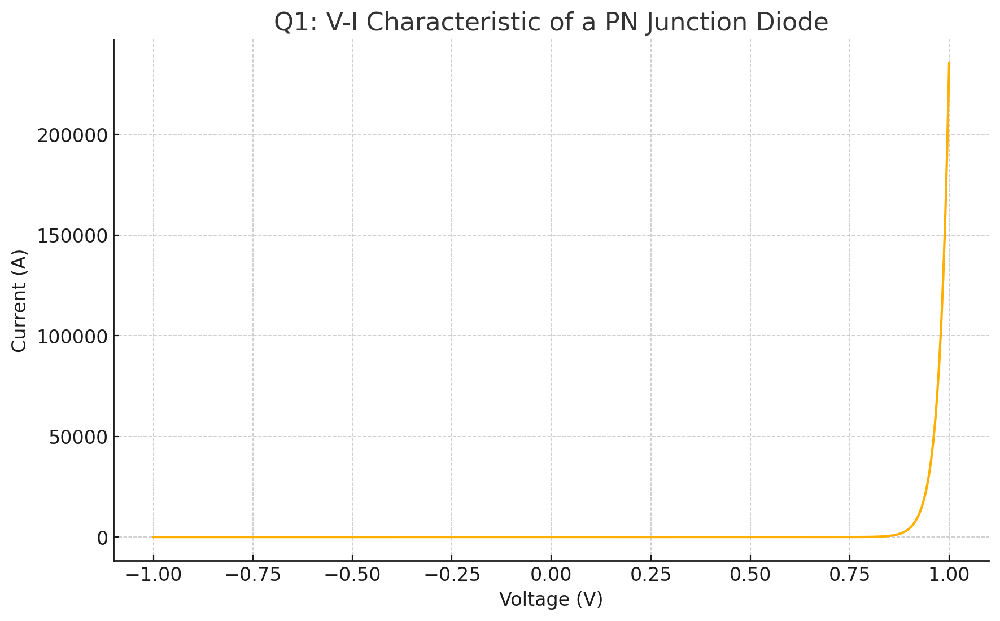
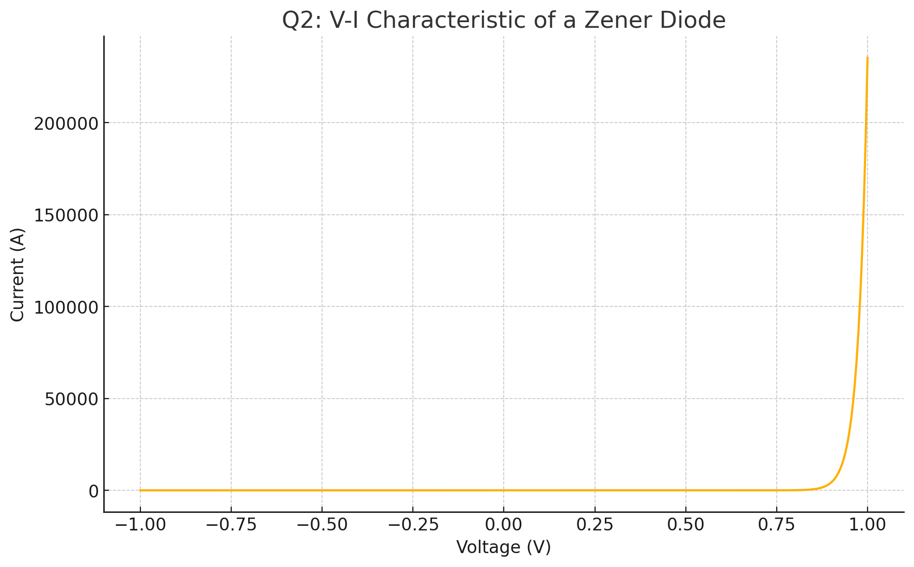
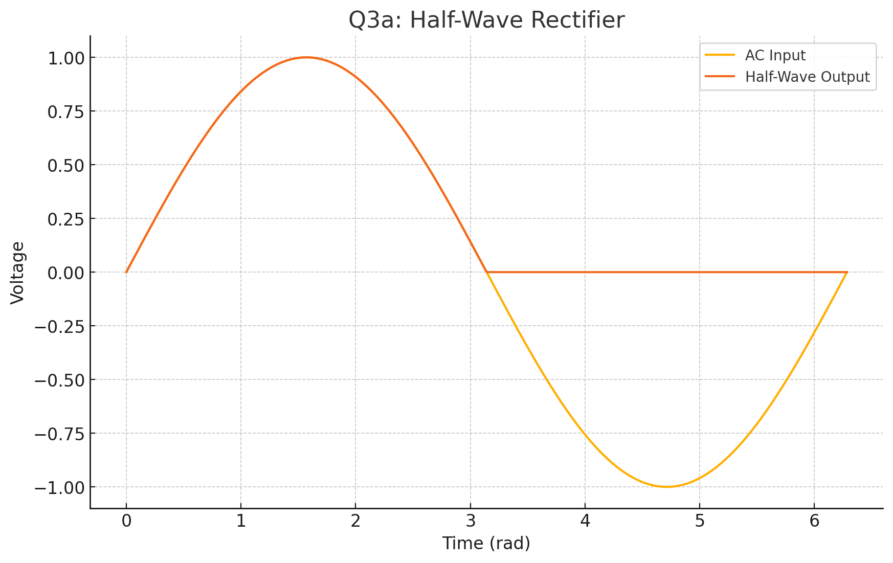
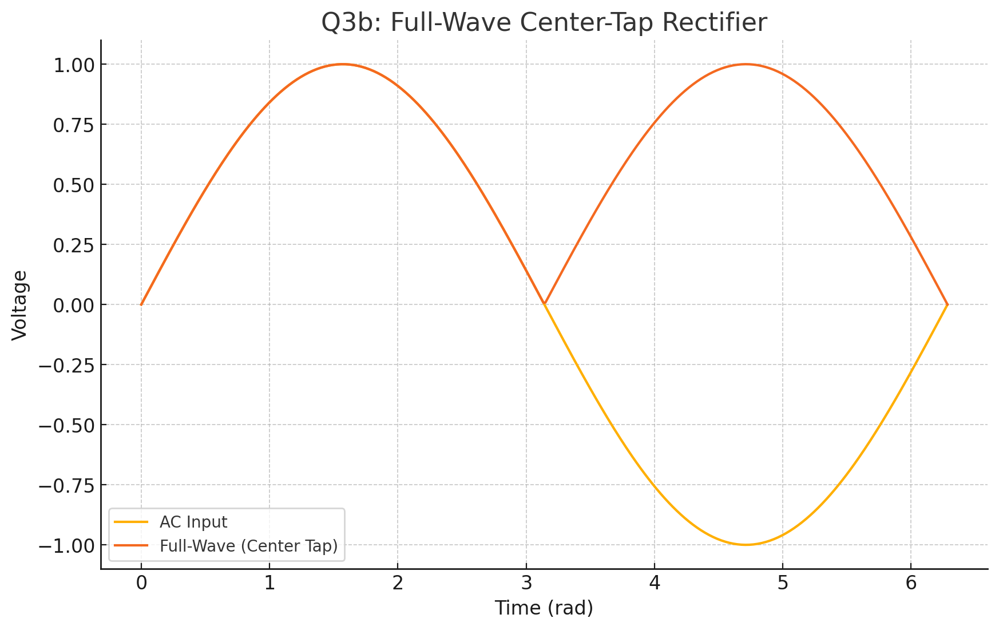
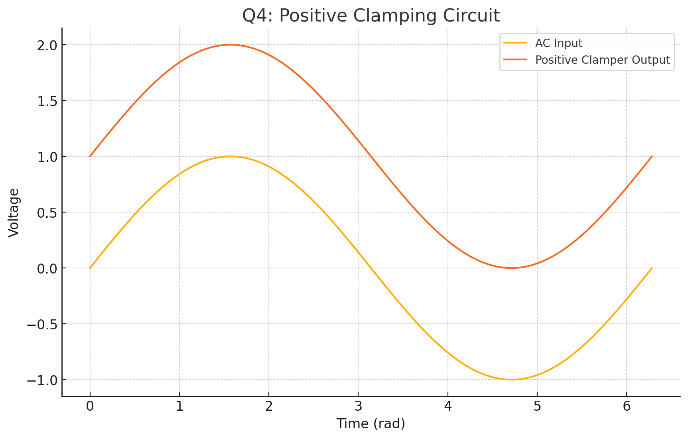
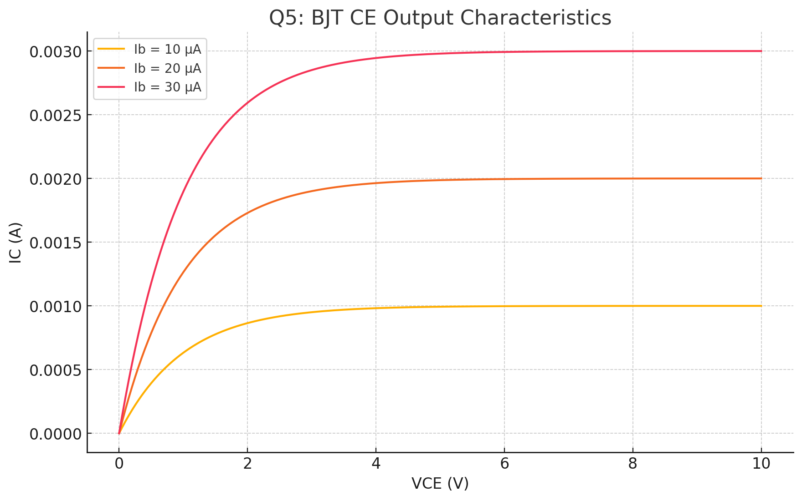
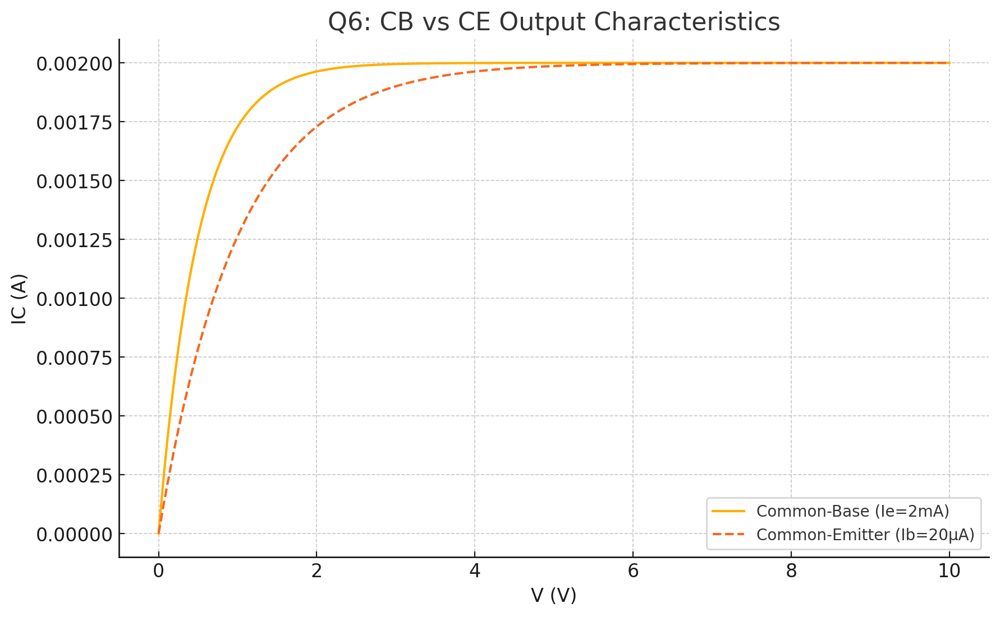
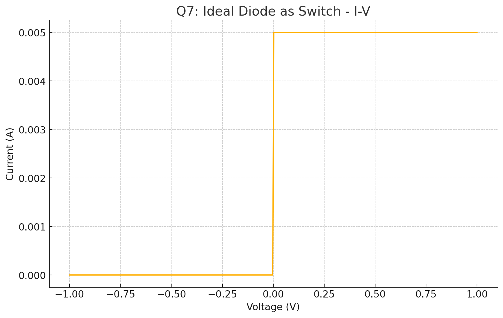

###....Analog Exam....

---

## Q1. V–I Characteristic of a PN Junction Diode
---

---
**Answer:**

* **Forward Bias (V<sub>F</sub> > 0):** Above the threshold (≈0.7 V for Si), the current rises exponentially.
* **Reverse Bias (V<sub>R</sub> < 0):** Only a tiny leakage current flows until breakdown (at V<sub>BR</sub>), after which large reverse current conducts.

**Test Circuit Diagram:**

```
      + V                       A
     ┌─┴─┐   ┌───┐       ┌───┐  │
(+)──┤ + ├──▶│ D │───I──▶│ A │──┤  
     │   │   └───┘   │   └───┘  │
     │   │            │        │
     │   └─Voltmeter──┘        │
     │                        └┐
     └─────────────────────────┘
      (–)                       (–)
```

* **A** = Ammeter (series)
* **Voltmeter** across diode D

---

## Q2. V–I Characteristic of a Zener Diode


**Answer:**

* **Forward Bias:** Behaves like a normal diode (≈0.7 V drop).
* **Reverse Bias:** Remains off until V<sub>R</sub> reaches Zener voltage V<sub>Z</sub>, then clamps at V<sub>Z</sub> with substantial current.

**Test Circuit Diagram:**

```
      + V
     ┌─┴─┐           ┌───┐
(+)──┤ + ├─R─▶──────▶│ Z │──┐
     │   │           └───┘  │
     │   │            │     │
     │   └─Voltmeter──┘     │
     │                     └┐
     └──────────────────────┘
      (–)
```

* **R** = Series resistor to limit I<sub>Z</sub>

---

## Q3. Rectifier Circuits

### a) Half‑Wave Rectifier


**Description:** Passes only the positive half‑cycles.

```
      AC
     ~───┐    
         │
         ▶| D  
         │───▶─┐  
         │     │  
        [RL]   │  
         │     │  
     ────┴─────┴── (Ground)
```

### b) Full‑Wave Center‑Tap Rectifier


```
          ┌──────┐
    AC ~──┤      ├─▶|───┐ 
          │      │ D1   │
     ┌───┬┤ CT   ├─▶|───┘
     │   │└──────┘  D2  
     │   │        ┌─┐  
     │   │       [RL]  
     │   └────────┴─┘  
    (–)             (–)
```

* **CT** = Center tap of transformer secondary

### c) Bridge Rectifier

```
        D1      D2
    +──▶|───┐  ┌───▶|───+
    │       │  │        │
   ~│ AC    └──┘    AC  │~ 
    │       ┌──┐        │
    +───|◀──┘  └──|◀──+─▶
        D4      D3
           │
          [RL]
           │
          (–)
```

---

## Q4. Clamping Circuit (Positive Clamper)
---

---

**Function:** Shifts an AC waveform upward by charging C on peaks.

```
      AC 
     ~───┐
         │
         ▶| D
         │───┬──▶─ Output (shifted)
         │   │
        [C]  │
         │   │
     ────┴───┴── (Ground)
```

* **D** charges **C** during negative peaks, clamping the lowest point at 0 V.

---

## Q5. BJT Working Regions & Characteristics
---


---

**Regions:**

1. **Cut‑off:** V<sub>BE</sub> < 0.7 V, no IC.
2. **Active:** V<sub>BE</sub> ≈ 0.7 V, V<sub>CE</sub> > V<sub>CE(sat)</sub>; IC ≈ β IB.
3. **Saturation:** Both junctions forward‑biased; max IC limited by circuit.

**Output Characteristic (CE config):**

```
IC │       ________
   │      /       
   │     /  Active region (IC ∝ IB)
   │    /
   │   /      
   │__/ Saturation  
   └──────────────── VCE
```

**Common‑Emitter Test Circuit:**

```
    VCC
     │
    [RC]
     │
     C
      \
       │    (Collector)
       │
       B───▶ [RB] ──▶ Input
      /
     E
     │
    GND
```

---

## Q6. V–I Characteristics of CB vs. CE

---

---

| Config. | Input Terminals | Output Terminals | Voltage Gain | Current Gain |
| ------- | --------------- | ---------------- | ------------ | ------------ |
| **CB**  | E–B             | C–B              | High         | <1           |
| **CE**  | B–E             | C–E              | High         | High (≈β)    |

**Common‑Base Circuit:**

```
   VCC
    │
   [RC]
    │
    C
     \
      │
     ─┴─┐
   E─|   │─── Input (emitter)
     └──┘
    GND
```

**Common‑Emitter Circuit:**

```
   VCC
    │
   [RC]
    │
    C
     \
      │
      B─── [RB] ── Input
     /
    E
    │
   GND
```

---

## Q7. Ideal Diode as a Switch (Numerical Example)

---

---
* **Forward Bias:** Ideal diode ≡ closed switch (0 Ω).
* **Reverse Bias:** Ideal diode ≡ open switch (∞ Ω).

**Example Circuit:** 5 V source, 1 kΩ resistor, ideal diode in series.

```
  +5 V ──▶|───[1 kΩ]─── GND
         D   
```

* **Forward (ON):** I = 5 V/1 kΩ = 5 mA
* **Reverse (OFF):** I = 0 mA

---